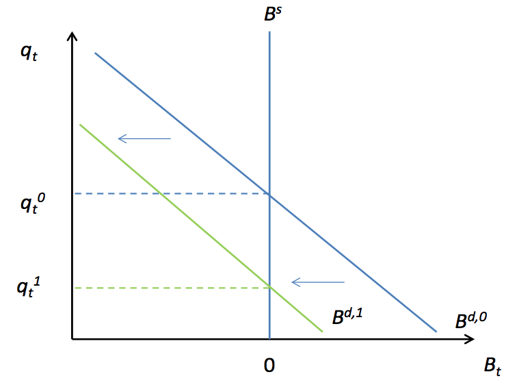

第二讲 两时期消费-储蓄模型
==========================

1. 导论
-------

本讲讨论简单的两时期消费-储蓄问题。在该模型中，家庭部门根据外生的收入流进行消费和储蓄决策。要使所处理问题加入动态因素，最少需要两个时期；同时，我们通常也可以将无限期问题分割成两个时期（当前期和未来延续期）。因此，我们以两时期开展研究不会使问题变得太复杂。基本消费--储蓄模型的确是现代动态宏观经济学的核心模型，深入熟练地掌握该模型是非常重要的。

这一简单的模型设定使得我们可以研究几个不同的现象。首先，这使我们可以在一个简单的框架内思考关于竞争性均衡的相关问题。
我把此类经济称为“禀赋经济”—这是因为总收入是外生的（因此也是固定的），没有生产，在均衡时总消费必然等于总收入。因而，均衡价格调整就可能使我们此前所知道的所有消费平滑的动机失效—总量消费必须等于总收入，通过价格调整会使得它与行为人优化过程相一致。第二，设定模型为两时期使得我们可以思考异质性与风险分担的作用。如果市场是按如下方式定义的“完全”的：行为人的收入流是具有随机异质性的，但是他们的消费却独立于其异质的收入，与总禀赋完全相关。如此设定有助于促进宏观经济学中采用代表性行为人模型来研究消费。

--------------

2. 一种类型的行为人
-------------------

假设有足够多的行为人，他们的偏好与禀赋完全相同。只要表现为价格接受者的行为人的人数足够多，我们就要以将行为人的人数标准化为1。

该行为人在时期\ :math:`t`\ 早上醒来，预期只生存两期，即\ :math:`t`\ 期和\ :math:`t+1`\ 期。行为人每期收到外生的确定性的禀赋收入\ :math:`Y_t`\ 和\ :math:`Y_{t+1}`\ 。行为人可以在第\ :math:`t`\ 期通过买卖债券\ :math:`B_t`\ 的形式来进行借款或储蓄，债券的价格是以消费单位计量的\ :math:`q_t`\ (即以此做为计价物)，:math:`B_t`\ 单位的债券在第\ :math:`t+1`\ 期会偿付\ :math:`B_t`\ 单位的收入，\ :math:`B_t`\ 可正可负，正值意味着行为人是储蓄者，负值意味着行为人是借款者。行为人的债券存量是生不带来，死不带去（即行为人在第\ :math:`t+1`\ 期死去时不会选择留下正的财富遗产，虽然行为人可能会愿意死去时留下债务，但是我们要排除这种情况）。行为人在每期都会面临如下两个流量预算约束：

.. math::

   C_t+q_tB_t\leq Y_t  \nonumber

.. math::

   C_{t+1}\leq Y_{t+1}+B_t \nonumber

行为人的目标是最大化其效用流的预期折现现值，其中两期的消费\ :math:`C_t`\ 和\ :math:`C_{t+1}`\ 分别以\ :math:`\ln C_t`\ 和\ :math:`\ln C_{t+1}`\ 的形式映射到效用函数中。行为人以\ :math:`0<\beta<1`\ 为折现因子对未来的效用流进行折现。行为人的优化问题可以表示为：

.. math::

   \max_{C_t, B_t, C_{t+1}} \ln C_t +\beta \ln C_{t+1}\\
   s.t\\
   C_t+q_tB_t\leq Y_t\\
   C_{t+1}\leq Y_{t+1}+B_t \nonumber

构造拉格朗日函数

.. math::

   \mathcal{L}=\ln C_t+\beta \ln C_{t+1}+\lambda_1(Y_t-C_t-q_tB_t)+\lambda_2(Y_{t+1}+B_t-C_{t+1}) \nonumber

其一阶条件为：

.. math::

   \begin{equation}
   \frac{\partial \mathcal{L}}{\partial C_t}=0 \Leftrightarrow \frac{1}{C_t}=\lambda_1
   \end{equation}

.. math::

   \frac{\partial \mathcal{L}}{\partial C_{t+1}}=0 \Leftrightarrow \beta \frac{1}{C_{t+1}}=\lambda_2

.. math::

   \frac{\partial \mathcal{L}}{\partial B_t}=0 \Leftrightarrow q_t\lambda_1=\lambda_2

将这3个公式整理，我们得到如下欧拉方程：

.. math::

   \begin{equation}
   q_t\frac{1}{C_t}=\beta\frac{1}{C_{t+1}}
   \end{equation}

该条件的直觉解释是：储蓄减少一单位（即减少一单位\ :math:`B_t`\ ）就会增加\ :math:`q_t`\ 单位当前消费，其边际效用为\ :math:`q_t\frac{1}{C_t}`\ ；而今天减少一单位储蓄则意味着明天少消费一单位，这使得明天的效用水平减少\ :math:`\frac{1}{C_{t+1}}`\ ，将其折现到第\ :math:`t`\ 期的效用，则为\ :math:`\beta \frac{1}{C_{t+1}}`\ 。在取得最优时，多一点储蓄的额外收益与额外成本必然相等。

上述所示问题就是决策问题：它得出一个最优条件，告诉我们行为人在给定价格下应如何行动。此时我们就可以为经济体定义一个竞争性均衡。竞争性均衡的一般性定义为，存在一组价格和资源配置体系，使得决策行为人可以采取最优行动（按照其决策规则行动），所有市场同时出清。此处的价格是\ :math:`q_t`\ ，资源配置为\ :math:`C_t`\ ，\ :math:`C_{t+1}`\ 和
:math:`B_t`\ 。这个经济的市场出清条件是什么呢？答案是\ :math:`B_t=0`\ 。为什么呢？所谓市场出清意味着对储蓄的需求必须等于借款供给。由于只有一种类型的行为人，如果行为人想要储蓄，就不会有借款供给；与之相似，如果行为人想要借入资金，就不会提供储蓄供给。因此必然会有\ :math:`B_t=0`\ 。与之等价的是，根据第一期的预算约束，这意味着必然有\ :math:`Y-t=C_t`\ ：即所有收入都必然被消费掉。

这一市场出清条件能成立吗？债券的价格\ :math:`q_t`\ 是保证这条件得以成立的条件。竞争性均衡的一般性定义为存在一组价格和资源配置，以使得(i)
资源配置可以求解出行为人的决策问题，（ii）所有市场出清。此处资源配置是\ :math:`C_t`\ 和\ :math:`C_{t+1}`\ ，价格是\ :math:`q_t`\ ；决策问题前面已经给出，市场出清条件为\ :math:`B_t=0`\ 。因为\ :math:`B_t=0`\ 意味着\ :math:`C_t=Y_{t}`\ 和\ :math:`C_{t+1}=Y_{t+1}`\ ，\ :math:`Y_t`\ 和\ :math:`Y_{t+1}`\ 是外生的，我们把这些条件代入到欧拉方程中，就可以解得债券的均衡价格：

.. math::

   q_t=\beta \frac{Y_t}{Y_{t+1}}

因此，均衡由价格\ :math:`q_t=\beta \frac{Y_t}{Y_{t+1}}`\ ，配置\ :math:`C_t=Y_{t}`\ 和\ :math:`C_{t+1}=Y_{t+1}`\ 以及\ :math:`B_t=0`\ 共同刻划出来。如果我们假设禀赋在所有时期都是常数，即\ :math:`Y_t=Y_{t+1}`\ ，则我们就有\ :math:`q_t=\beta`\ 。

我们可以进行一些有趣的比较静态分析，将其与局部均衡下的永久收入假说加以比较。首先，我们来看一下如果当期收入\ :math:`Y_t`\ 增加的效果。基本的永久收入假说理论表明，家庭将会进行跨期平滑消费—因此。他们将会把当前收入的增加额中储蓄起来一部分，以使得两期消费\ :math:`C_t`\ 和\ :math:`C_{t+1}`\ 都可以增加。但是我们根据市场出清条件可以知道，在均衡时，家庭部门无法实现这个计划，因为该条件要求以下两式必须成立：\ :math:`C_t=Y_t`\ 和\ :math:`C_{t+1}=Y_{t+1}`\ 。换句话说，该条件是指在均衡时，家庭必须在\ :math:`t`\ 时期把额外获得的收入全部消费掉。家庭为什么会愿意做出这样的决策？根据公式（5）可以得知，债券的价格会上升，当\ :math:`Y_t`\ 上升时，\ :math:`q_t`\ 也必然会上升。从直觉上看，当\ :math:`Y_t`\ 上升时，对债券的需求\ :math:`B_t`\ 也会上升（即家庭会想要进行储蓄以增加未来消费）。但是，在均衡时家庭无法持有债券，实际上，债券的供给为0。需求的增加推高了债券的价格。我们通过一个简单的供给-需求模型加以说明：

.. figure:: /Users/fengwencheng/CloudStation/simsadv/source/figures/sims0201.png
   :alt: sims0201

   sims0201

接下来我们来看一下未来收入\ :math:`Y_{t+1}`\ 增加的情况。我们知道这使人们会马上要增加当前的消费，要想实现这个目标，就需要借款或减少一些储蓄。但是在均衡时，当期的消费无法改变，因为当前收入\ :math:`Y_t`\ 没有改变。我们可以由均衡时\ :math:`q_t`\ 的表达式得到这一结论，即\ :math:`q_t`\ 会下降。实际上，未来收入的增加会减少对债券的需求，既然在均衡时债券的供给是固定为0，这会拉低债券的价格。我们通过下图说明这点：\ |sims0202|

上述分析表明有，模型中的行为人在均衡时无法根据其总禀赋的变化来平滑其消费。因为即使模型中存在在债券，只要每个人都是要一样的，那么在均衡时就无人持有债券。换句话说，是行为人无法为其总收入的“风险”进行“保险”—我在此处将“风险”和“保险”加上了引号，是因为我们此处的模型是确定性的，但我希望读者能够理解其中的含义。

2.1 对债券开支的另一种处理方式
~~~~~~~~~~~~~~~~~~~~~~~~~~~~~~

在说明上述问题时，我们

3. 两种类型的行为人
-------------------

| ​
| ​
| ​

